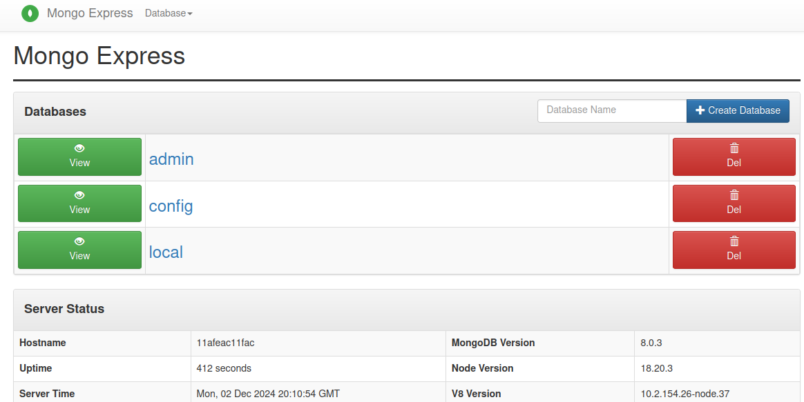
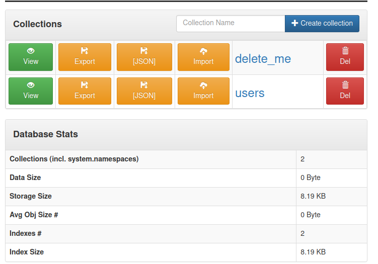

- [Tarea 6](#tarea-6)
  - [Preparar redes](#preparar-redes)
  - [Crear volumen](#crear-volumen)
  - [Levantar el contenedor MongoDB](#levantar-el-contenedor-mongodb)
  - [Levantar el Contenedor Mongo Express](#levantar-el-contenedor-mongo-express)
  - [Contenedores actuales](#contenedores-actuales)
  - [Logs de mongo expres](#logs-de-mongo-expres)
  - [Prueba la persistencia de BBDD](#prueba-la-persistencia-de-bbdd)
    - [Crear Coleccion](#crear-coleccion)
    - [Añadir Documentos a la Colección users](#añadir-documentos-a-la-colección-users)
  - [Verificacion](#verificacion)
    - [Red](#red)
    - [Conectividad a la base de datos](#conectividad-a-la-base-de-datos)

## Tarea 6

### Preparar redes
> [!TIP] 
> Crear la red de mongodb-network

Comando:
```bash
docker network create mongodb-network

docker network ls
```

Resultado:
```bash
07e1154482c8c0447870bd4f00dae148344625c9a24d271b9ae5f9840fcb9b8c

NETWORK ID     NAME                                            DRIVER    SCOPE
1c88cf3f99ec   bridge                                          bridge    local
272635d95d92   cuidadoplantas-jonaycontreras_plantas-network   bridge    local
3da72d9b2271   cuidadoplantas_plantas-network                  bridge    local
6cdf8f23cc17   host                                            host      local
07e1154482c8   mongodb-network                                 bridge    local
0053e6430ab4   none                                            null      local
9b9b996a7d7f   tomcat-network                                  bridge    local
```

### Crear volumen
Comando:
```bash
docker volume create mongodb-data

docker volume ls
```

Respuesta:
```bash
mongodb-data

DRIVER    VOLUME NAME
local     2e9bec2b1e814a89523d35a2770f920046920dbeb02dbfe21f8a9080cbe80640
local     3b131f64696fb10aa21dc743381233110d6546005f8af125acefae4af5ae3ab9
local     9bae072de4374231726bc3e1d38cdcf2143589bf36814aa71530e7a71f397012
local     009e7b936efb345e30216a95f0e7f4fb093309d30a156df075c4bf9341a8cc2d
local     60dc6fda63096fed02227d95c3fc87da893dd82148cbe8b961365c36bdd0d126
local     205babd9eed8ff4417bc1b027365bdb88c3330751f26cf22f26ab2bb3ba94c28
local     1338e28a36a720ad3d32c7b0b2d0710970e2a55d5a5fc00b305e967ea3a000d3
local     25577840a982984f001c0f1e67687264c19511fa4ba7fe56a0b3b83c9e6f7321
local     a9f75c07f709a515d447139d3ab7150a2791a33eb39656cc5fef1b4cdd411776
local     cuidadoplantas-jonaycontreras_plantas-dbdata
local     cuidadoplantas-jonaycontreras_volumen-compartido
local     cuidadoplantas_plantas-dbdata
local     cuidadoplantas_volumen-compartido
local     ef8c90dd1ff5201ef8f1c265d9535520acea6836dce78f1c41af1f2638b2c642
local     mongodb-data
local     plantas_plantas-app
local     plantas_plantas-dbdata
```

### Levantar el contenedor MongoDB

Comando:
```bash
docker run -d --name mongodb-container \
  --network mongodb-network \
  -e MONGO_INITDB_ROOT_USERNAME=admin \
  -e MONGO_INITDB_ROOT_PASSWORD=admin123 \
  -v mongodb-data:/data/db \
  -p 27017:27017 \
  mongo:latest
```

Respuesta:
```bash
Unable to find image 'mongo:latest' locally
latest: Pulling from library/mongo
afad30e59d72: Already exists 
2ab913c649fa: Pull complete 
142bff30356f: Pull complete 
ea6a78a8bfa5: Pull complete 
e87de320d14a: Pull complete 
e8fb995504bd: Pull complete 
edbe36f78898: Pull complete 
1f774f57f04f: Pull complete 
Digest: sha256:c165af1a407eefce644877bf5a59ba3d9ca762e62b4f1723c919dc08dc32f4d0
Status: Downloaded newer image for mongo:latest
11afeac11fac6b69f0bfdba300e46ffe955753f1b6f94cef26eb85505c53a4f1
```

### Levantar el Contenedor Mongo Express
Comando:
```bash
docker run -d --name mongo-express-container \
  --network mongodb-network \
  -e ME_CONFIG_MONGODB_ADMINUSERNAME=admin \
  -e ME_CONFIG_MONGODB_ADMINPASSWORD=admin123 \
  -e ME_CONFIG_MONGODB_SERVER=mongodb-container \
  -p 8081:8081 \
  mongo-express:latest
```

Respuesta:
```bash
Unable to find image 'mongo-express:latest' locally
latest: Pulling from library/mongo-express
619be1103602: Pull complete 
7e9a007eb24b: Pull complete 
5189255e31c8: Pull complete 
88f4f8a6bc8d: Pull complete 
d8305ae32c95: Pull complete 
45b24ec126f9: Pull complete 
9f7f59574f7d: Pull complete 
0bf3571b6cd7: Pull complete 
Digest: sha256:1b23d7976f0210dbec74045c209e52fbb26d29b2e873d6c6fa3d3f0ae32c2a64
Status: Downloaded newer image for mongo-express:latest
f8b14289806c52c9f86f6a5238e7994739bcbe06e4eb560fc3c57035e4fd7283
```

### Contenedores actuales
```bash
CONTAINER ID   IMAGE                  COMMAND                  CREATED              STATUS              PORTS                                           NAMES
f8b14289806c   mongo-express:latest   "/sbin/tini -- /dock…"   34 seconds ago       Up 31 seconds       0.0.0.0:8081->8081/tcp, :::8081->8081/tcp       mongo-express-container
11afeac11fac   mongo:latest           "docker-entrypoint.s…"   About a minute ago   Up About a minute   0.0.0.0:27017->27017/tcp, :::27017->27017/tcp   mongodb-container
```

### Logs de mongo expres
Comando:
```bash
docker logs mongo-express-container
```

Respuesta:
```bash
Welcome to mongo-express 1.0.2
------------------------


Mongo Express server listening at http://0.0.0.0:8081
Server is open to allow connections from anyone (0.0.0.0)
basicAuth credentials are "admin:pass", it is recommended you change this in your config.js!
```

### Prueba la persistencia de BBDD


#### Crear Coleccion
> [!TIP]
> Crear la coleccion



#### Añadir Documentos a la Colección users
> [!TIP]
> Añadir Documentos a la Colección users


### Verificacion
#### Red
> [!TIP]
> Lanzar diagnostico de red

Comando:
```bash
docker network inspect mongodb-network
```

Respuesta:
```bash
[
    {
        "Name": "mongodb-network",
        "Id": "07e1154482c8c0447870bd4f00dae148344625c9a24d271b9ae5f9840fcb9b8c",
        "Created": "2024-12-02T19:59:03.029614556Z",
        "Scope": "local",
        "Driver": "bridge",
        "EnableIPv6": false,
        "IPAM": {
            "Driver": "default",
            "Options": {},
            "Config": [
                {
                    "Subnet": "172.19.0.0/16",
                    "Gateway": "172.19.0.1"
                }
            ]
        },
        "Internal": false,
        "Attachable": false,
        "Ingress": false,
        "ConfigFrom": {
            "Network": ""
        },
        "ConfigOnly": false,
        "Containers": {
            "11afeac11fac6b69f0bfdba300e46ffe955753f1b6f94cef26eb85505c53a4f1": {
                "Name": "mongodb-container",
                "EndpointID": "3ed14516905a659e0c4e32f50c0cb966b63cb6e5e4b4b4b8aa463c2f888fd894",
                "MacAddress": "02:42:ac:13:00:02",
                "IPv4Address": "172.19.0.2/16",
                "IPv6Address": ""
            },
            "f8b14289806c52c9f86f6a5238e7994739bcbe06e4eb560fc3c57035e4fd7283": {
                "Name": "mongo-express-container",
                "EndpointID": "922c72720c96407e12677c1e932ef75342b82843b5ec540f496adfd90daac84f",
                "MacAddress": "02:42:ac:13:00:03",
                "IPv4Address": "172.19.0.3/16",
                "IPv6Address": ""
            }
        },
        "Options": {},
        "Labels": {}
    }
]
```

#### Conectividad a la base de datos
> [!TIP]
> Ver las colecciones
Comando:
```bash
docker exec -it mongodb-container mongosh -u admin -p admin123

use testdb

show collections
```

Respuesta:
```bash
delete_me
users
```

> [!TIP]
> Insertar uno nuevo

Comando:
```bash
db.users.insertOne({
    name: "Pepe",
    email: "quiero-ser-como-pepe@example.com",
    age: 65
})
```

Respuesta:
```bash
{
  acknowledged: true,
  insertedId: ObjectId('674e1860116c1fa027c1c18c')
}
```

> [!TIP]
> Ver usuarios

Comando:
```bash
db.users.find()
```

Respuesta:
```bash
[
  {
    _id: ObjectId('674e169d5ba0f7cf4884ffe2'),
    name: 'John Doe',
    email: 'john@example.com',
    age: 30
  },
  {
    _id: ObjectId('674e1860116c1fa027c1c18c'),
    name: 'Pepe',
    email: 'quiero-ser-como-pepe@example.com',
    age: 65
  }
]
```